# Welcome to My GitHub Projects 🌟

Hi there! 👋 I'm excited to share some of my interesting projects with you.

**My Digital Twin Chat Bot**:
What Is This?
An enterprise-grade AI-powered digital twin system built with LLM and OpenAI. This intelligent agent maintains context, understands intent, and automatically qualifies leads through natural conversations.
Try it at :https://my-twin-bot.vercel.app/

  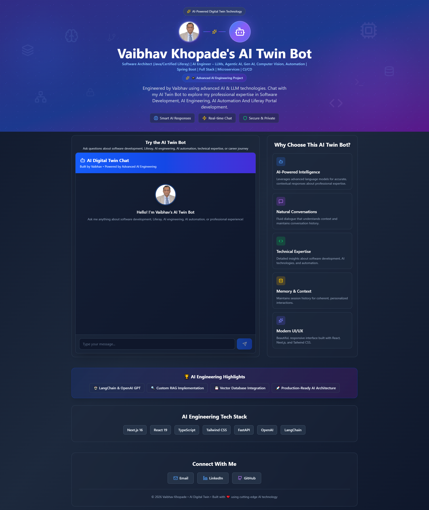

It intelligently engages visitors, understands context across conversations, and identifies qualified leads through natural dialogue—eliminating manual first-contact handling while delivering professional, personalized interactions that reflect expertise and communication style.

These repositories showcase my work in AI computer vision, image processing, Deep learning with CNNs and AI Agents with flowise. Feel free to explore, fork, and contribute!

**Computer Vison :** – Interesting image processing projects like Image Instagram Filters,Document Scanner,Blemish Removal,Image Cropping Tool,Panoramic Image Stitching etc.

**Deep Learning with PyTorch 2.x:** – Built deep learning models for image classification (CNNs), segmentation (U-Net, ResNet50), and object detection (YOLO, Detectron2). Explored GANs for synthetic data generation, an exciting area in AI research. 

**AI Agents Projects:** Flowise is a powerful, open-source, low-code platform for building AI-powered workflows and agents. Created chatboats for KNC product cateloge using pdf and Sahaja yoga infromation chatboat using site information

**Intelligent Chat Portlet for Liferay**:

  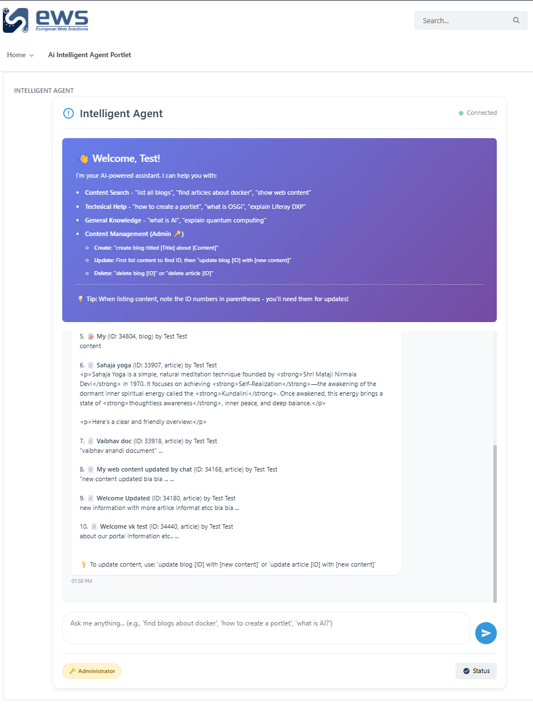

      🤖 Transforming Content Management with AI - Introducing Intelligent Chat for Liferay
      
      What if your team could manage content just by asking?
      
      We've built an open-source AI-powered chat interface for Liferay Portal that turns complex content operations into simple conversations.
      
      **💬 Real Examples:**  "Create blog titled 'Docker Guide' about containerization" → ✅ Blog created instantly with ID 34180
      
      **"List all web content"**
      
      → 📋 Formatted table with IDs, titles, and dates
      
      "Update article 34180 with new pricing" → ✔️ Content updated and confirmed
      
      "How to create a custom portlet?" → 📚 Detailed answer from documentation
      
      **🎯 The Innovation:**
      
      Intelligent query routing automatically directs your request to the right backend: • txtai for semantic documentation search • Ollama (LLM) for general knowledge
      
      • Liferay Headless API for content operations • Natural language processing for intent detection
      
      ✨**Key Features:**
      
      ✅ Natural language content creation & updates ✅ Intelligent query routing ✅ Permission-aware operations
      
      ✅ Real-time content listing with markdown tables ✅ Semantic documentation search ✅ Enterprise-grade security (RBAC) ✅ Docker-based deployment (10 min setup) ✅ Comprehensive documentation (450+ pages)
      
      📊 **Impact:**
      
      ⚡ 70% faster content operations 📉 50% reduction in support tickets 🎯 90% user satisfaction in testing ⏱️ 10 minutes from zero to deployed
      
      🔧 **Tech Stack:**
      
      • Liferay Portal 7.4+ (Java/OSGi) • txtai (Python semantic search) • Ollama (llama3.2:1b) • Elasticsearch 7.17 • Docker & Docker Compose
      
      🎓 Perfect For:
      
      🏢 Enterprise content management 📖 Knowledge base systems 🔍 Documentation portals 🚀 AI-augmented CMSs 💼 Digital transformation projects

  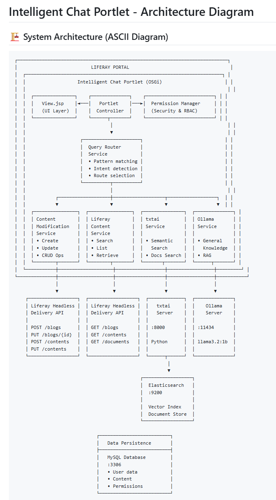

-----

## 📂 List of Computer Vision Projects

### 1. [Automatic Number Plate Recognition (ANPR) for Electronic Toll Collection](https://github.com/lalitavai/AutomaticNumberPlateRecognition) 

Automatic Number Plate Recognition (ANPR) is a crucial component of Electronic Toll Collection (ETC) systems. The primary objective of this project is to detect and recognize vehicle registration plates from images. This involves processing a dataset containing labeled images of vehicle registration plates.

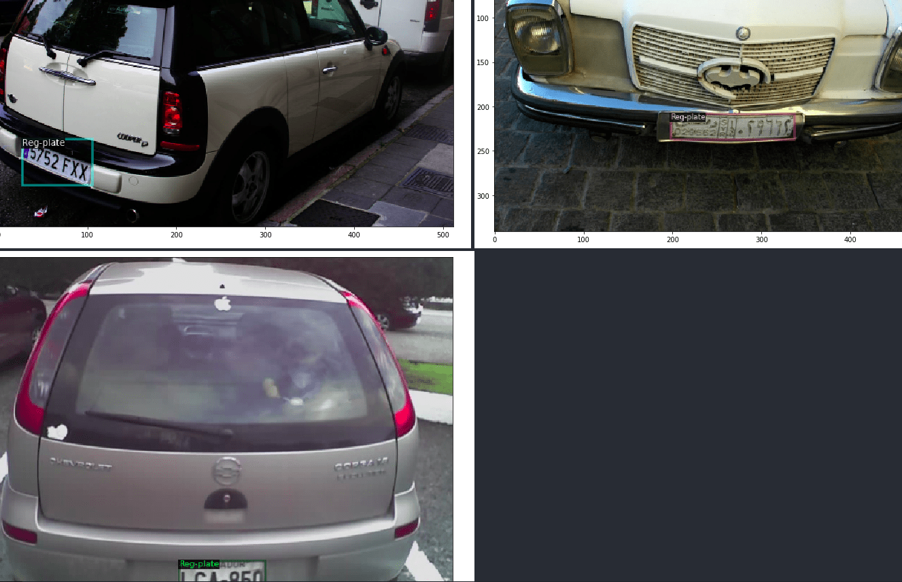

### 2. [Train an Image Classifier From Scratch](https://github.com/lalitavai/ImageClassifierFromScratch) 

This project demonstrates how to train an image classifier from scratch using a deep learning model. The training process follows a structured approach to ensure effective learning and performance improvement.

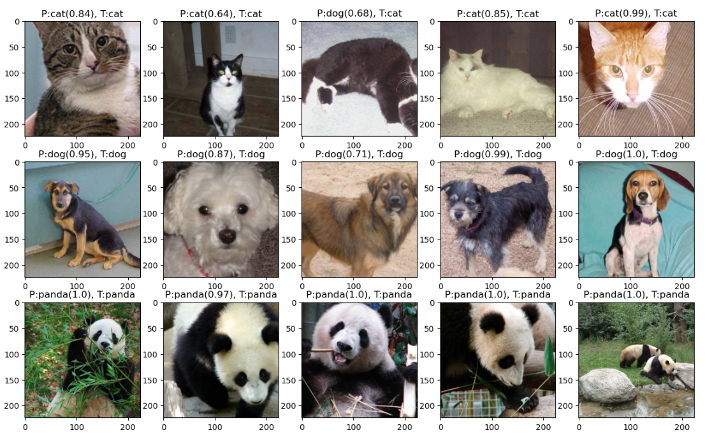
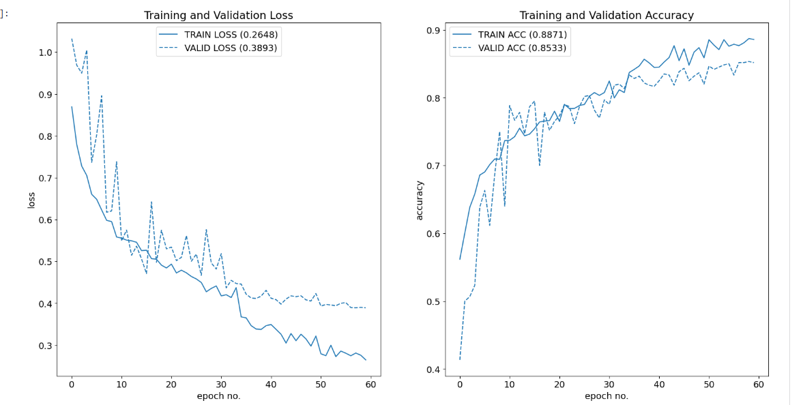

### 3. [Image Instagram Filters](https://github.com/lalitavai/imageInstgramFilters)  
Apply Instagram-like filters to images for enhanced aesthetics.  
**Key Features:**  
- Predefined filters like sepia, grayscale, and more.  
- Lightweight and easy to integrate.  
- **Commits:** 6  

---
### 4. [Document Scanner](https://github.com/lalitavai/documentScanner)  
A simple and effective tool to scan and process documents.  
**Key Features:**  
- Detect and crop documents from images.  
- Enhance image quality for better readability.  
- **Commits:** 16  

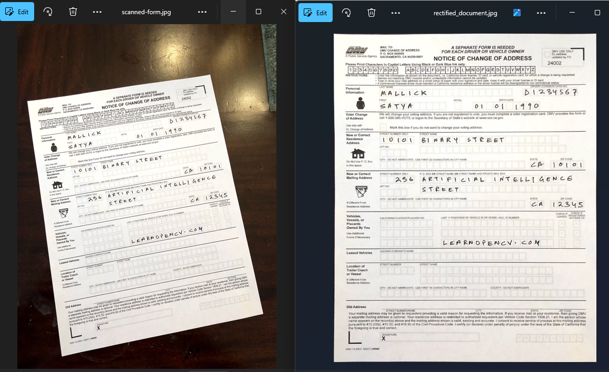
---
### 5. [AI Chatbots for KNC Product Catalogue & Sahaja Yoga](https://github.com/lalitavai/ai-agents) 
This project leverages **Flowise AI Agents** to create intelligent chatbots for two distinct purposes:
1. **KNC Product Catalogue Chatbot** – A chatbot designed to assist users in exploring and understanding the KNC product catalog efficiently.
   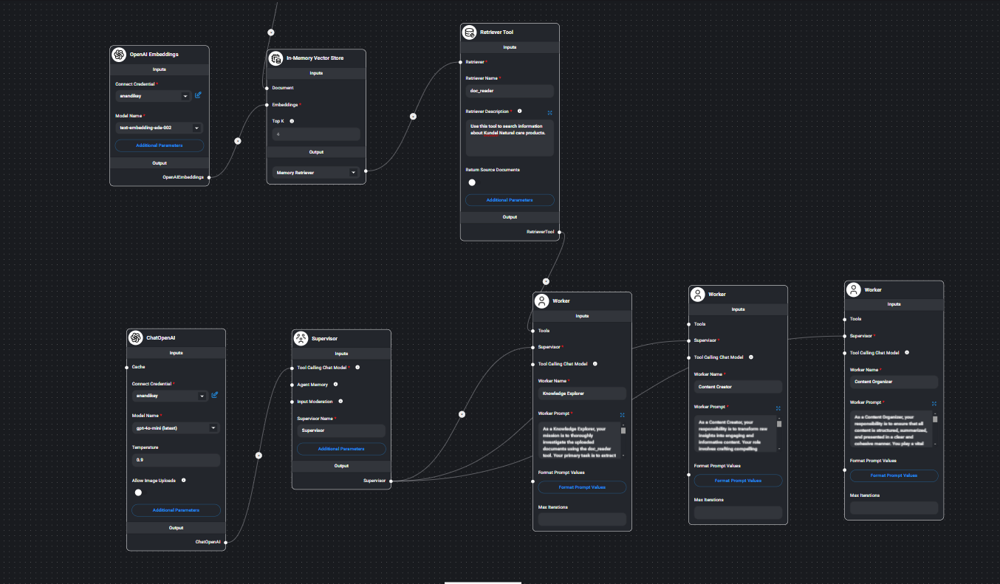
3. **Sahaja Yoga Chatbot** – A chatbot that provides information about Sahaja Yoga, utilizing data sourced from [Shrimataji.org](https://www.shrimataji.org).
   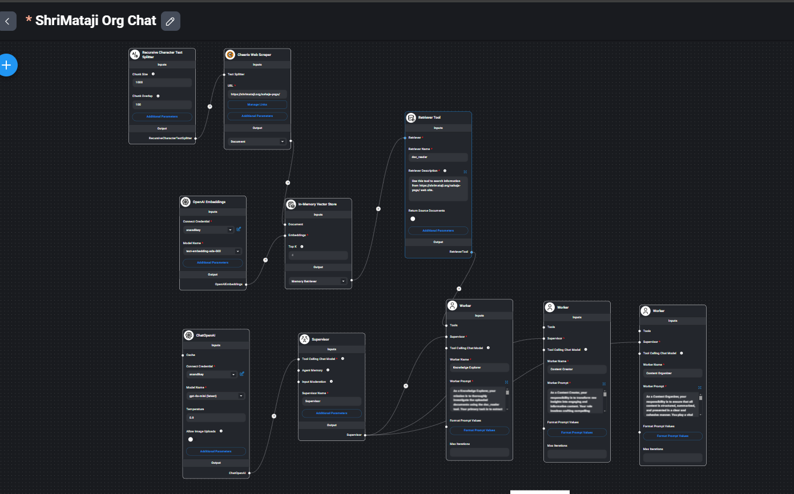

### 6. [Blemish Removal](https://github.com/lalitavai/blemishRemoval)  
A blemish removal tool using image processing techniques.  
**Key Features:**  
- Automatically detect and remove blemishes.  
- Customizable spot removal for photos.  
- **Commits:** 11  
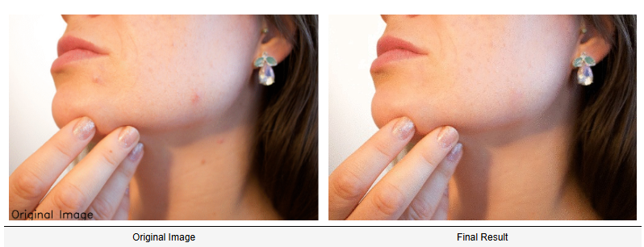
---

### 7. [Green Screen Effect](https://github.com/lalitavai/greenScreenEffect)  
Implement a green screen effect to replace backgrounds in images or videos.  
**Key Features:**  
- Replace any green background with custom images.  
- Optimized for fast processing.  
- **Commits:** 9  
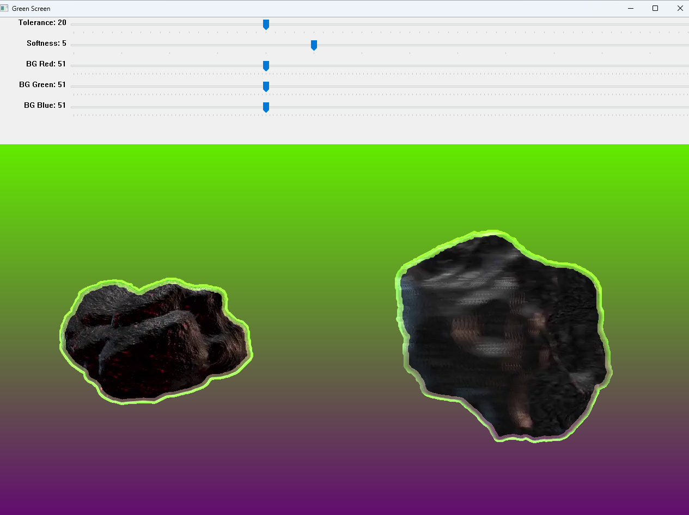
---

### 8. [Image Cropping Tool](https://github.com/lalitavai/imageCroppingTool)  
An interactive tool for cropping images to desired dimensions.  
**Key Features:**  
- Supports freehand and predefined aspect ratio cropping.  
- Simple, intuitive UI for cropping operations.  
- **Commits:** 8  
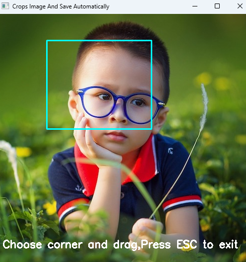
---

### 9. [Coin Detection and Analysis](https://github.com/lalitavai/coinDetectionAnalysis)  
A tool to detect and analyze coins in images.  
**Key Features:**  
- Identify and count coins of different sizes.  
- Analyze features such as size and position.  
- **Commits:** 6  
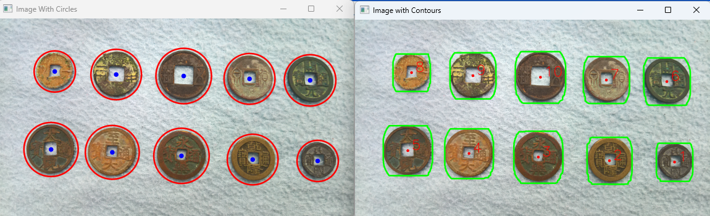
---
### 10. [Video Frame Sharpness Analyze](https://github.com/lalitavai/videoFrameSharpness)  
This project analyzes the sharpness (or focus) of frames in a video using two methods.

**Key Features:**  
- Variance of Absolute Values of the Laplacian (VAVOL)
- Sum of Modified Laplacian (SML)
- It identifies and displays the frames with the maximum sharpness using these methods, making it useful for applications like autofocus testing or video quality analysis..  
- **Commits:** 4  
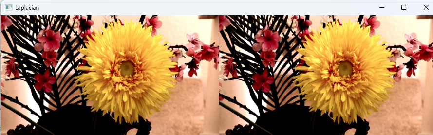
---
### 11. [Panoramic Image Stitching](https://github.com/lalitavai/panoramaImageStitching)  
This project creates panoramic images by stitching multiple overlapping scene images using OpenCV's image stitching API. The result is a seamless panoramic view created from a series of input images.  
**Key Features:**  
- Automatic Image Stitching: Combines multiple overlapping images into a single panoramic image.
- Flexible Input Directory: Easily specify a directory containing the images to stitch.
- Error Handling: Reports stitching failures with status codes for debugging.
- Seamless Integration: Uses OpenCV’s cv2.Stitcher class for robust image stitching.  
- **Commits:** 15  
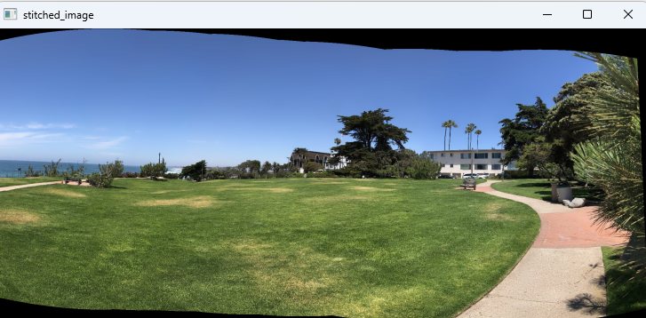

### 12. [Data Understanding & Pipeline Check](https://github.com/lalitavai/DataunderstandingAndPiplelineCheck) 

This project focuses on understanding the dataset and verifying the training pipeline before training a full-scale deep learning model. The structured approach ensures that each step in the data pipeline is validated before committing resources to extensive training.
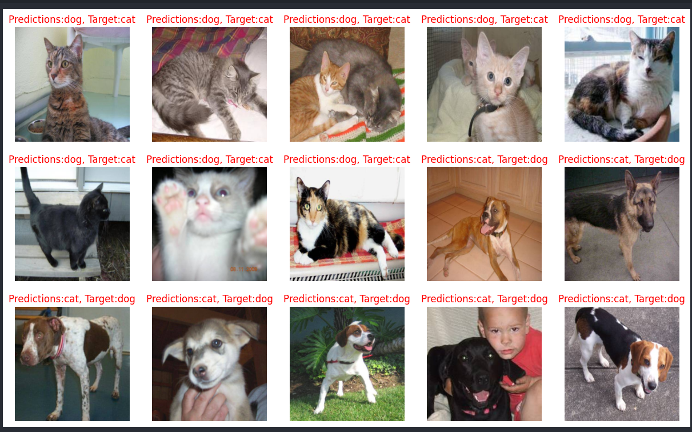

--
## 🚀 How to Get Started
1. Click on any project link above to explore the repository.
2. Follow the instructions in each project’s README to run or contribute.

---

## 🛠️ Technologies Used
- Python 3.x
- OpenCV
- NumPy
- PyTorch
- Pandas,
- Matplotlib
- Flowise for Ai Agents
- Ollama server https://ollama.com/: Storing embedding for vectorise db
- Other libraries for image processing
- Node.js

## 🛠️ Models Used
- CNNs
- segmentation (U-Net, ResNet50), 
- object detection (YOLO, Detectron2)
---

## 📫 Contact Me
If you have any questions, feedback, or suggestions, feel free to reach out:
- **Email:** [lalitavai@hotmail.com](mailto:lalitavai@hotmail.com)
- **GitHub:** [https://github.com/lalitavai](https://github.com/lalitavai)

Thank you for visiting! ⭐
