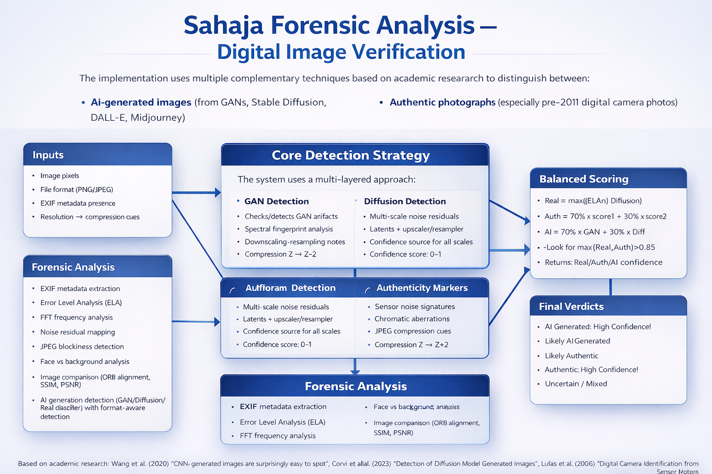

# 🌟 Vaibhav Khopade — AI,Agents, Computer Vision & Enterprise Engineering

> **Senior Software Engineer (26+ yrs)** | **AI ,Agents & Computer Vision Specialist** | **Enterprise Java & Liferay Architect**  
> Building **AI-powered systems**, **forensic-grade detection platforms**, and **enterprise-scale applications**

---

## 🧭 Quick Overview 

- 🧠 **AI & Computer Vision** — Image forensics, GAN & diffusion detection, OpenCV, PyTorch  
- 🕵️ **Forensic Systems** — Court-ready reporting, chain of custody, evidence workflows  
- 🤖 **AI Agents & Chatbots** — LLMs, Flowise, voice-enabled assistants  
- 🏢 **Enterprise Engineering** — Java, Spring, Liferay, Docker, Elasticsearch  
- 🚀 **Production-first mindset** — Scalable, secure, Dockerized systems  

---

## 🏷️ Tech Stack

---

## 🤖 Featured Project — Digital Twin AI Chatbot (Voice Enabled)

An **enterprise-grade AI-powered digital twin** built with LLMs that maintains context, understands intent, and qualifies leads through natural conversations.

🔗 **Live Demo:** https://my-twin-bot.vercel.app/

  

<strong>🎤 Voice Features — Interactive AI Assistant</strong>

- **🎙️ Voice Input** — Click the mic and speak naturally  
- **🔊 Voice Output** — Hear responses in natural speech  
- **🔀 Hybrid Mode** — Text + voice simultaneously  
- **👤 Voice Customization** — Male / Female voice  
- **🔒 Privacy First** — All voice processing in your browser (no audio upload)  
- **⚡ Zero Latency** — Instant recognition + speech synthesis  
- **📱 Mobile Ready** — Works on Chrome for Android  

<strong>🎯 How to Use</strong>

1. Open: https://my-twin-bot.vercel.app/  
2. Click **Settings** (⚙️)  
3. Choose input/output modes + voice gender  
4. Click the **microphone** and start speaking  

<strong>🔐 Privacy & Security</strong>

- ✅ No audio upload  
- ✅ No storage of voice recordings  
- ✅ Microphone permission only with consent  
- ✅ Conversations stay between you and your browser  

---

## 🕵️‍♂️ Featured Project — Forensic Image & AI-Detection System

A **full-stack forensic web application** designed to detect **AI-generated, manipulated, and authentic images** with **end-to-end case management** and **court-ready reporting**.

  

<strong>🚀 What the System Delivers</strong>

- 🧩 End-to-end forensic case tracking  
- 👥 Role-based access (Admin / Analyst / User) + audit-ready chain of custody  
- 🔬 Deep forensic analysis (EXIF, ELA, FFT, noise patterns, JPEG artifacts, similarity metrics)  
- 📄 Professional **PDF + JSON** reports (hashes, signatures, structured forensic narratives)  
- ⚙️ Background processing for large images + Dockerized deployment  

<strong>🧠 Core Detection & Forensic Modules</strong>

- EXIF metadata extraction & validation  
- Error Level Analysis (ELA)  
- FFT frequency-domain analysis  
- Noise residual mapping  
- JPEG blockiness detection  
- Face vs background consistency  
- Image comparison: ORB alignment, SSIM, PSNR  
- AI generation detection: GAN / Diffusion / Real classifiers (format-aware logic)  

<strong>🖼️ Supported Image Categories</strong>

- AI-generated: GANs, Stable Diffusion, DALL·E, Midjourney  
- Authentic photos: special focus on **pre-2011 digital camera images**  

<strong>🧪 Detection Strategy</strong>

- GAN artifact detection  
- Diffusion model detection  
- Authenticity verification (camera signatures + sensor characteristics)  

<strong>📚 Research Foundation</strong>

- Wang et al. (2020) — CNN-generated images  
- Corvi et al. (2023) — Diffusion model detection  
- Lukas et al. (2006) — Digital camera identification via sensor pattern noise  

<strong>✅ Current Status</strong>

- Core features implemented end-to-end  
- Professional, court-ready reports generated  
- Workflow supports real forensic / evidence use cases  

---

## 🧠 AI Agents & Enterprise Chat Systems

<strong>🤖 Intelligent Chat Portlet for Liferay (AI-Powered CMS)</strong>

Turn complex content operations into simple conversations.

<table>
  <tr>
    <td align="center">
     
       
      <b>Liferay Agent Chat</b>
    </td>
    <td align="center">
      
       
      <b>Intelligent Chat Architecture</b>
    </td>
  </tr>
</table>

<strong>🎯 Examples</strong>

- “Create blog titled 'Docker Guide' about containerization” → ✅ Blog created instantly  
- “List all web content” → 📋 Formatted table with IDs, titles, dates  
- “Update article 34180 with new pricing” → ✔️ Updated and confirmed  
- “How to create a custom portlet?” → 📚 Answered from documentation  

<strong>🎯 **Innovation**</strong>

- Intelligent query routing to the right backend:
  - txtai for semantic documentation search  
  - Ollama (LLM) for general knowledge  
  - Liferay Headless API for content operations  
  - NLP for intent detection   

<strong>🎯 **Tech Stack**</strong>

- Liferay Portal 7.4+ (Java/OSGi)  
- txtai (semantic search)  
- Ollama (llama3.2:1b)  
- Elasticsearch 7.17  
- Docker & Docker Compose  

---

## 👁️ Computer Vision Projects (with Proof Images)

<strong>📂 Project Index (Click to Expand)</strong>

### 1) [Automatic Number Plate Recognition (ANPR) for Electronic Toll Collection](https://github.com/lalitavai/AutomaticNumberPlateRecognition)

### 2) [Train an Image Classifier From Scratch](https://github.com/lalitavai/ImageClassifierFromScratch)
  

### 3) [Image Instagram Filters](https://github.com/lalitavai/imageInstgramFilters)

### 4) [Document Scanner](https://github.com/lalitavai/documentScanner)

### 5) [AI Chatbots for KNC Product Catalogue & Sahaja Yoga (Flowise Agents)](https://github.com/lalitavai/ai-agents)
  

### 6) [Blemish Removal](https://github.com/lalitavai/blemishRemoval)

### 7) [Green Screen Effect](https://github.com/lalitavai/greenScreenEffect)

### 8) [Image Cropping Tool](https://github.com/lalitavai/imageCroppingTool)

### 9) [Coin Detection and Analysis](https://github.com/lalitavai/coinDetectionAnalysis)

### 10) [Video Frame Sharpness Analyze](https://github.com/lalitavai/videoFrameSharpness)

### 11) [Panoramic Image Stitching](https://github.com/lalitavai/panoramaImageStitching)

### 12) [Data Understanding & Pipeline Check](https://github.com/lalitavai/DataunderstandingAndPiplelineCheck)

---

## 🛠️ Technologies Used

<strong>Click to View</strong>

- Python 3.x, OpenCV, NumPy, Pandas, Matplotlib  
- PyTorch  
- Flowise (AI Agents)  
- Ollama (embeddings / LLM runtime)  
- Docker  
- Node.js  
- Other image processing libraries  

---

## 🧠 Models Used

- CNNs  
- Segmentation: U-Net, ResNet50  
- Object Detection: YOLO, Detectron2  

---

## 🚀 How to Get Started

1. Click any project link above to explore its repository  
2. Follow the repo instructions to run or contribute  

---

## 📫 Contact

- **Email:** [lalitavai@hotmail.com](mailto:lalitavai@hotmail.com)  
- **GitHub:** https://github.com/lalitavai  

⭐ Thanks for visiting!
