# 🌟 Senior Software Architect|Liferay Architect | AI Engineer|Computer Vision & AI Enterprise Engineering  | RAG | Agentic AI | LLMOps 

> **Senior Software Engineer (26+ yrs)** | **AI ,Agents & Computer Vision Specialist** | **Enterprise Java & Liferay Architect**  
> Building **AI-powered systems**, **forensic-grade detection platforms**, and **enterprise-scale applications**
> My current focus is on **RAG, LLM engineering, Agentic AI, AI security, LLMOps and enterprise AI integration**
> **AI integrations in Liferay  platforms** — combining modern AI capabilities with the engineering discipline required for secure, reliable business applications.

---

## 🧭 Quick Overview 

- 🧠 **AI & Computer Vision** — Image forensics, GAN & diffusion detection, OpenCV, PyTorch  
- 🕵️ **Forensic Systems** — Court-ready reporting, chain of custody, evidence workflows  
- 🤖 **AI Agents & Chatbots** — LLMs, Flowise, voice-enabled assistants  
- 🏢 **Enterprise Engineering** — Java, Spring, Liferay, Docker, Elasticsearch  
- 🚀 **Production-first mindset** — Scalable, secure, Dockerized systems  

---

## 🏷️ Tech Stack

---
## 🧠 Featured Project — EWS CareAgent — Secure RAG & Agentic AI

**CareAgent** is a production-shaped AI engineering reference platform I architected and developed to demonstrate how **RAG, LLMs and Agentic AI** can be engineered for secure enterprise applications.

> **Core principle:** The model can reason and propose. The application owns authorization, approval and execution.

### 🚀 Engineering Highlights

* 🔎 **Permission-Aware RAG** — hybrid lexical + vector retrieval, pgvector, RRF, reranking, citations and abstention
* 🤖 **Agentic AI** — bounded workflows, state/memory, tool selection and closed tool registry
* 👤 **Controlled Actions** — human approval, ownership validation, TTL, reauthorization, idempotency and audit
* 🛡️ **AI Security** — ACL-before-context, prompt-injection protection, structured validation and multi-layer guardrails
* 📊 **AI Evaluation** — Hit@K, Precision, Recall, MRR, nDCG, adversarial and regression testing
* 🦙 **LLMOps & Local AI** — provider abstraction, Ollama/Llama, fallback, telemetry and model/prompt lifecycle
* 🔐 **Privacy by Design** — **Allowed? → Needed? → Must it leave?**

### 🏗️ Architecture

  

### ⚙️ Core Stack

`Python` · `FastAPI` · `PostgreSQL` · `pgvector` · `Redis` · `React` · `TypeScript` · `Docker` · `Ollama` · `pytest` · `Playwright`

### 💡 What CareAgent Demonstrates

CareAgent is **not just an AI chatbot**. It combines retrieval, reasoning and controlled actions with conventional application security and measurable evaluation.

**RAG Quality + Agentic AI + AI Security + Human Control + LLMOps**

The goal is simple: build AI systems that can do useful work **without making the LLM the application's security or authorization boundary**.

## 🌿  My Healthy Living

A production-ready **personal healthy-living companion** that combines practical meal planning, recipe management, shopping, pantry tracking, progress check-ins, and configurable email routines in one mobile-friendly web application.

The platform blends **Mediterranean food principles** with carefully curated **Ayurvedic food knowledge**, while keeping traditional guidance, modern nutrition, recipe verification, and personal experience clearly separated.

🔗 **Live Demo:** https://my-healthy-living-guide.vercel.app

  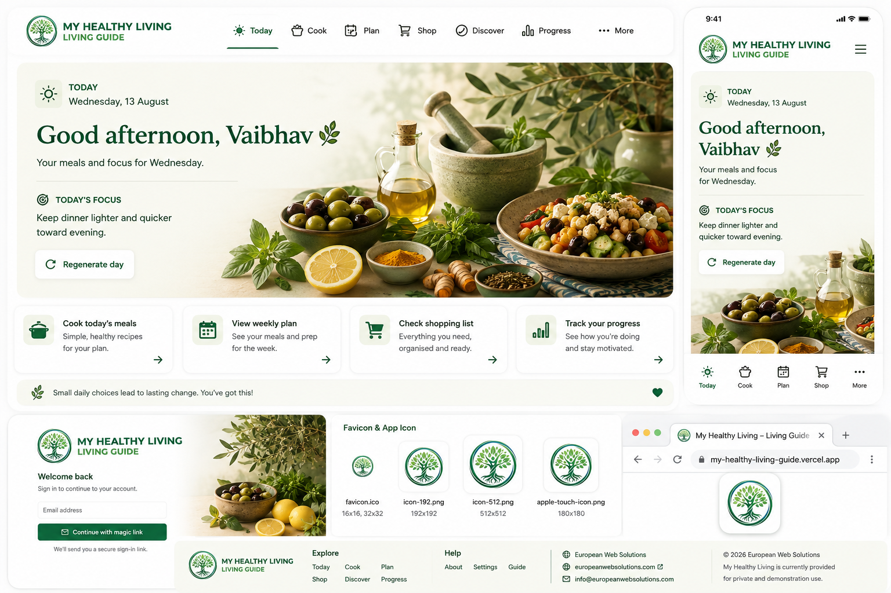

<strong>✨ What the Application Delivers</strong>

- 🌞 **Personalized Today Dashboard** — Daily meals, focus, prep tasks, shopping preview, and progress
- 📅 **Adaptive Weekly Planner** — Deterministic meal planning with exclusions, preferences, locks, replacements, and explainable recommendations
- 🍲 **Recipe Library** — Curated recipes, favorites, My Recipes, personal versions, cooking notes, and history
- 🛒 **Smart Shopping Workflow** — Consolidated ingredient identity, pantry subtraction, store/category grouping, print/PDF/copy/share
- 🧺 **Pantry Management** — Have / Low / Out status with quantity-aware shopping integration
- 📈 **Progress Tracking** — Lightweight daily check-ins with weekly and monthly views
- 🔎 **Discover** — Recipes, ingredients, knowledge, and optional external recipe discovery
- 🌿 **Ingredient Library** — Multilingual ingredients, where-to-buy information, pantry/shopping actions, and trusted image fallbacks
- 📧 **Daily / Weekly Email Companion** — Timezone-aware scheduled routines with branded HTML emails and recipient-specific privacy
- 👥 **Private Multi-user Access** — Supabase magic-link authentication, owner/demo roles, household isolation, and RLS
- 📱 **PWA / Mobile-first UX** — Responsive design, installable application, mobile shopping mode, and safe offline fallback

<strong>🧠 Knowledge & Trust Architecture</strong>

The system separates knowledge by source and confidence rather than mixing everything into generic wellness advice.

- Classical Ayurveda references
- Institutional Ayurveda sources
- Mediterranean dietary guidance
- Modern nutrition sources
- Food-safety sources
- Source tiers and provenance
- Human-review workflow
- Traditional vs modern knowledge labels
- No automatic medical or dosha diagnosis
- No unreviewed knowledge used by the meal planner

<strong>🍽️ Recipe & Personalization Model</strong>

Three distinct recipe layers are maintained:

1. **Curated Recipes** — protected editorial recipes
2. **My Recipes** — user-created personal recipes
3. **My Version** — personal adaptations of curated recipes

Cooking experience can include:

- ratings
- quick feedback tags
- cooking notes
- cooking history
- favorites
- personal versions

The original curated recipe always remains protected.

<strong>⚙️ Planning & Shopping Engine</strong>

The meal planner follows a deterministic pipeline:

`hard filters → preferences → soft scoring → ranking → controlled relaxation → plan`

Important safeguards include:

- excluded foods are never relaxed
- rejected recipes never enter plans
- seeded deterministic selection
- variety and recent-recipe penalties
- pantry and expiry awareness
- family / schedule / light-dinner signals
- locked meals survive regeneration
- reason codes explain recommendations

Shopping reuses canonical ingredient identity rather than fuzzy matching and safely preserves incompatible units instead of inventing conversions.

<strong>📧 Notification System</strong>

- Daily Companion
- Weekly Planner
- Monthly Review
- Prep / Shopping / Meal reminders
- Multiple recipients
- Per-recipient preferences
- Europe/Athens and IANA timezone support
- Hourly Vercel cron evaluation
- Resend verified sender
- Delivery audit + occurrence-key idempotency
- Personal progress kept private from household recipients
- App users and notification recipients remain separate concepts

<strong>🔐 Architecture & Security</strong>

- Next.js / React
- Supabase Auth with magic links
- PostgreSQL / Supabase
- Row Level Security
- Household + personal data ownership
- Vercel deployment
- Resend email delivery
- PWA / offline fallback
- Server-only service-role and email credentials
- Private/demo access model
- Protected editorial Studio
- Canonical content separated from personal content

<strong>🛠️ Tech Stack</strong>

- Next.js
- React / TypeScript
- Tailwind CSS
- Supabase / PostgreSQL
- Vercel
- Resend
- PWA / Service Worker
- Lucide React
- Deterministic TypeScript planning engine

<strong>✅ Current Status</strong>

- Production deployment complete
- Mobile-first UI complete
- Recipe / ingredient / shopping quality audits in place
- Cloud plans, pantry, shopping, progress and personal content supported
- Multi-recipient notification architecture complete
- Private demo-user testing underway
- Further development intentionally paused while real-user feedback is collected

---

🤖  **Digital Twin AI Chatbot (Voice Enabled)**

An **enterprise-grade AI-powered digital twin** built with LLMs that maintains context, understands intent, and qualifies leads through natural conversations.

🔗 **Live Demo:** https://my-twin-bot.vercel.app/

  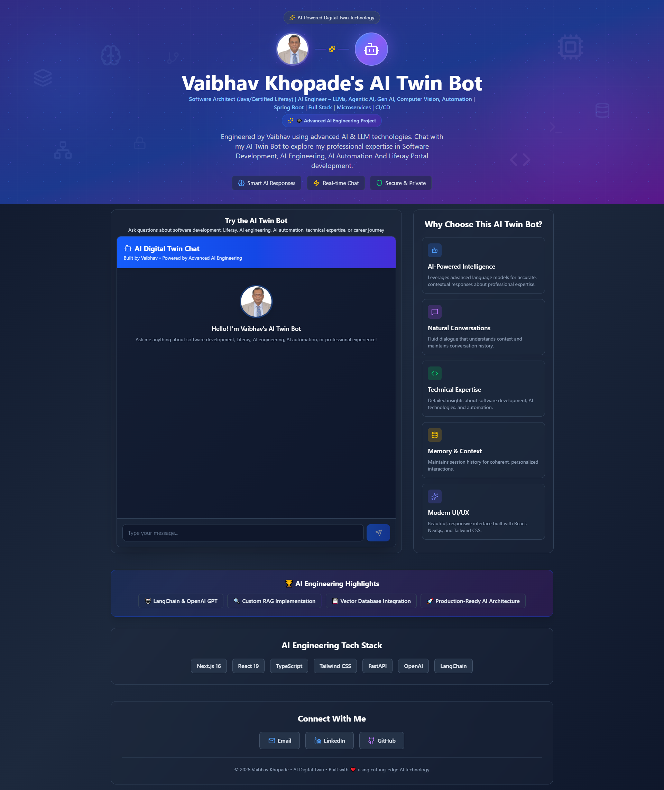

<strong>🎤 Voice Features — Interactive AI Assistant</strong>

- **🎙️ Voice Input** — Click the mic and speak naturally  
- **🔊 Voice Output** — Hear responses in natural speech  
- **🔀 Hybrid Mode** — Text + voice simultaneously  
- **👤 Voice Customization** — Male / Female voice  
- **🔒 Privacy First** — All voice processing in your browser (no audio upload)  
- **⚡ Zero Latency** — Instant recognition + speech synthesis  
- **📱 Mobile Ready** — Works on Chrome for Android  

<strong>🎯 How to Use</strong>

1. Open: https://my-twin-bot.vercel.app/  
2. Click **Settings** (⚙️)  
3. Choose input/output modes + voice gender  
4. Click the **microphone** and start speaking  

<strong>🔐 Privacy & Security</strong>

- ✅ No audio upload  
- ✅ No storage of voice recordings  
- ✅ Microphone permission only with consent  
- ✅ Conversations stay between you and your browser  

---

## 🕵️‍♂️ Featured Project — Forensic Image & AI-Detection System

A **full-stack forensic web application** designed to detect **AI-generated, manipulated, and authentic images** with **end-to-end case management** and **court-ready reporting**.

  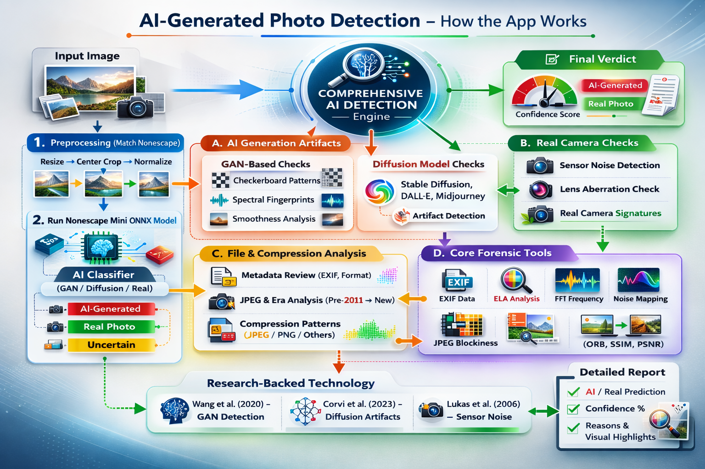

<strong>🚀 What the System Delivers</strong>

- 🧩 End-to-end forensic case tracking  
- 👥 Role-based access (Admin / Analyst / User) + audit-ready chain of custody  
- 🔬 Deep forensic analysis (EXIF, ELA, FFT, noise patterns, JPEG artifacts, similarity metrics)  
- 📄 Professional **PDF + JSON** reports (hashes, signatures, structured forensic narratives)  
- ⚙️ Background processing for large images + Dockerized deployment  

<strong>🧠 Core Detection & Forensic Modules</strong>

- EXIF metadata extraction & validation  
- Error Level Analysis (ELA)  
- FFT frequency-domain analysis  
- Noise residual mapping  
- JPEG blockiness detection  
- Face vs background consistency  
- Image comparison: ORB alignment, SSIM, PSNR  
- AI generation detection: GAN / Diffusion / Real classifiers (format-aware logic)  

<strong>🖼️ Supported Image Categories</strong>

- AI-generated: GANs, Stable Diffusion, DALL·E, Midjourney  
- Authentic photos: special focus on **pre-2011 digital camera images**  

<strong>🧪 Detection Strategy</strong>

- GAN artifact detection  
- Diffusion model detection  
- Authenticity verification (camera signatures + sensor characteristics)  

<strong>📚 Research Foundation</strong>

- Wang et al. (2020) — CNN-generated images  
- Corvi et al. (2023) — Diffusion model detection  
- Lukas et al. (2006) — Digital camera identification via sensor pattern noise  

<strong>✅ Current Status</strong>

- Core features implemented end-to-end  
- Professional, court-ready reports generated  
- Workflow supports real forensic / evidence use cases  

---

## 🧠 AI Agents & Enterprise Chat Systems

<strong>🤖 Intelligent Chat Portlet for Liferay (AI-Powered CMS)</strong>

Turn complex content operations into simple conversations.

<table>
  <tr>
    <td align="center">
     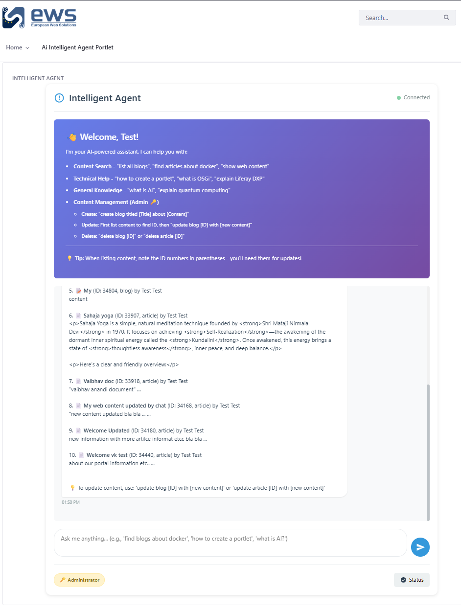
       
      <b>Liferay Agent Chat</b>
    </td>
    <td align="center">
      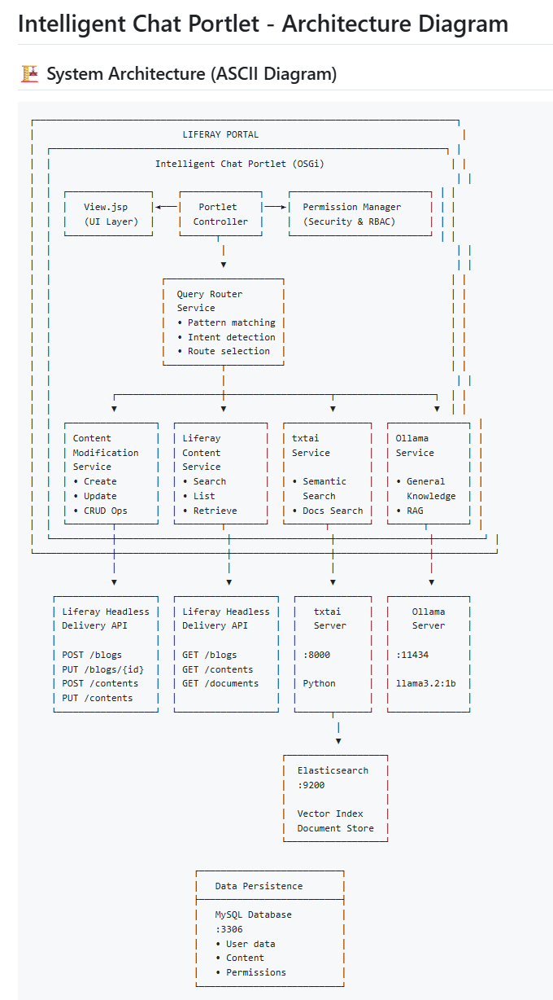
       
      <b>Intelligent Chat Architecture</b>
    </td>
  </tr>
</table>

<strong>🎯 Examples</strong>

- “Create blog titled 'Docker Guide' about containerization” → ✅ Blog created instantly  
- “List all web content” → 📋 Formatted table with IDs, titles, dates  
- “Update article 34180 with new pricing” → ✔️ Updated and confirmed  
- “How to create a custom portlet?” → 📚 Answered from documentation  

<strong>🎯 **Innovation**</strong>

- Intelligent query routing to the right backend:
  - txtai for semantic documentation search  
  - Ollama (LLM) for general knowledge  
  - Liferay Headless API for content operations  
  - NLP for intent detection   

<strong>🎯 **Tech Stack**</strong>

- Liferay Portal 7.4+ (Java/OSGi)  
- txtai (semantic search)  
- Ollama (llama3.2:1b)  
- Elasticsearch 7.17  
- Docker & Docker Compose  

---

## 👁️ Computer Vision Projects (with Proof Images)

<strong>📂 Project Index (Click to Expand)</strong>

### 1) [Automatic Number Plate Recognition (ANPR) for Electronic Toll Collection](https://github.com/lalitavai/AutomaticNumberPlateRecognition)
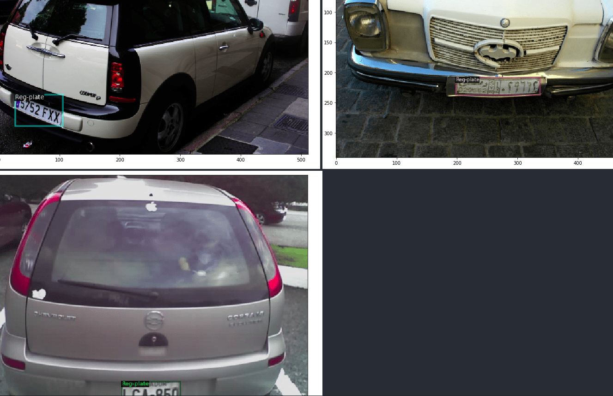

### 2) [Train an Image Classifier From Scratch](https://github.com/lalitavai/ImageClassifierFromScratch)
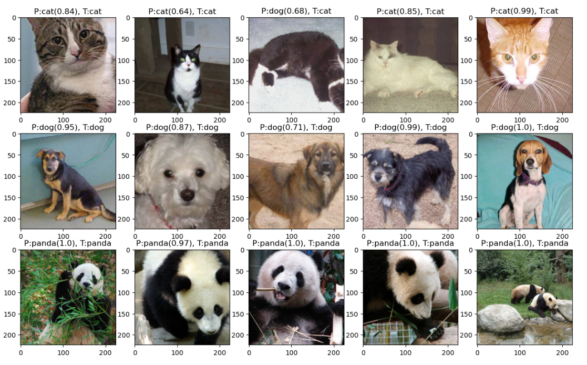  
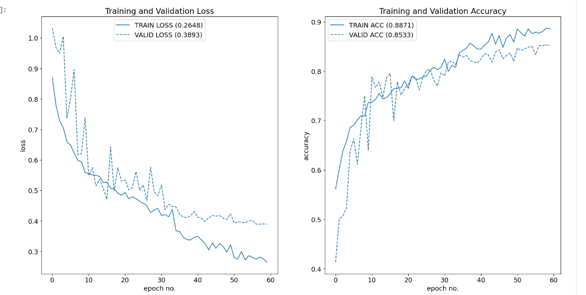

### 3) [Image Instagram Filters](https://github.com/lalitavai/imageInstgramFilters)
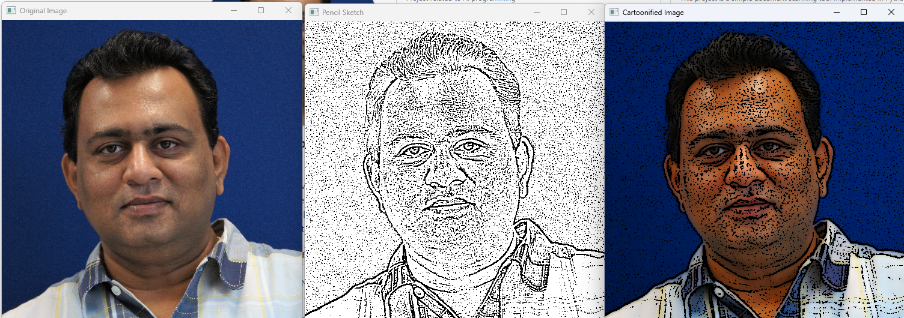

### 4) [Document Scanner](https://github.com/lalitavai/documentScanner)
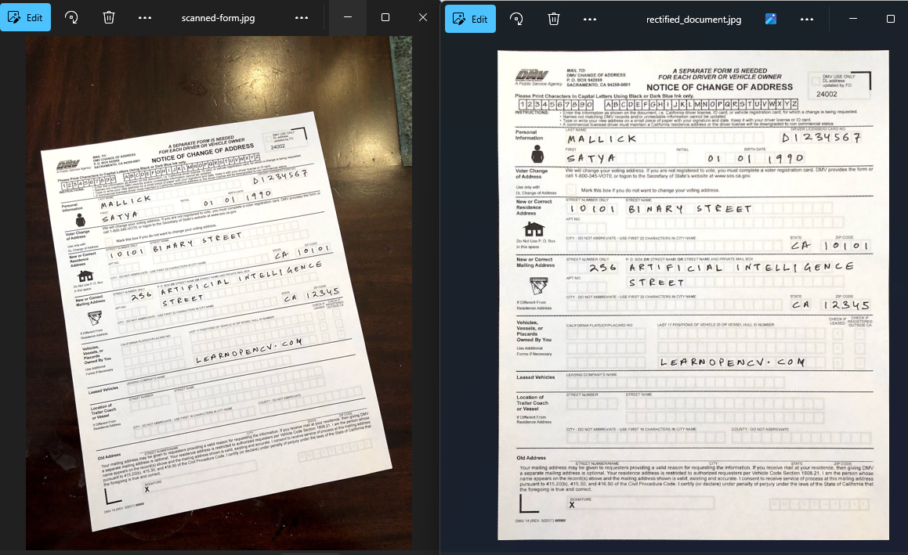

### 5) [AI Chatbots for KNC Product Catalogue & Sahaja Yoga (Flowise Agents)](https://github.com/lalitavai/ai-agents)
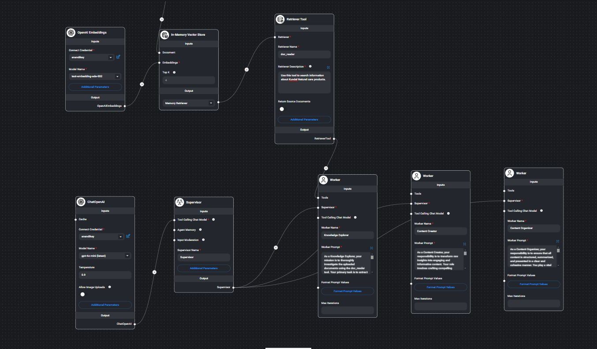  
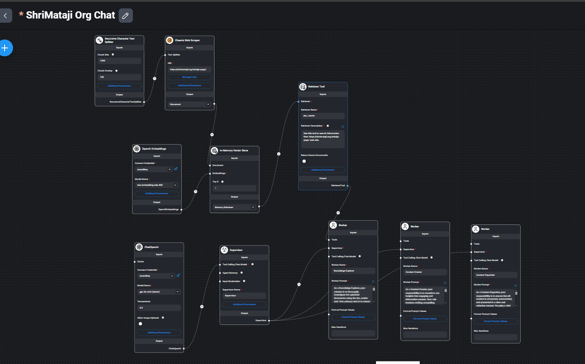

### 6) [Blemish Removal](https://github.com/lalitavai/blemishRemoval)
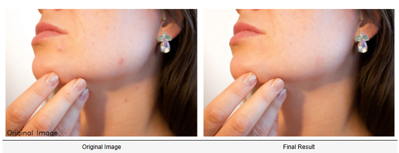

### 7) [Green Screen Effect](https://github.com/lalitavai/greenScreenEffect)
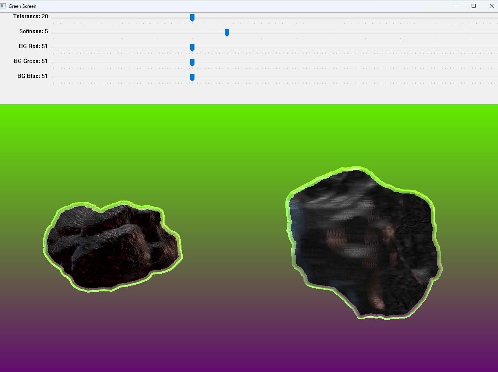

### 8) [Image Cropping Tool](https://github.com/lalitavai/imageCroppingTool)

### 9) [Coin Detection and Analysis](https://github.com/lalitavai/coinDetectionAnalysis)

### 10) [Video Frame Sharpness Analyze](https://github.com/lalitavai/videoFrameSharpness)
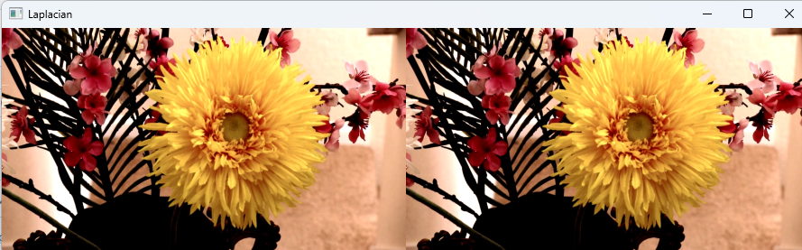

### 11) [Panoramic Image Stitching](https://github.com/lalitavai/panoramaImageStitching)
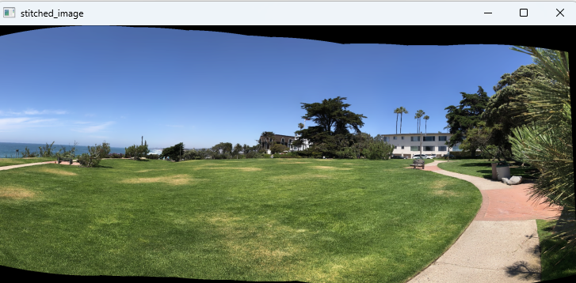

### 12) [Data Understanding & Pipeline Check](https://github.com/lalitavai/DataunderstandingAndPiplelineCheck)
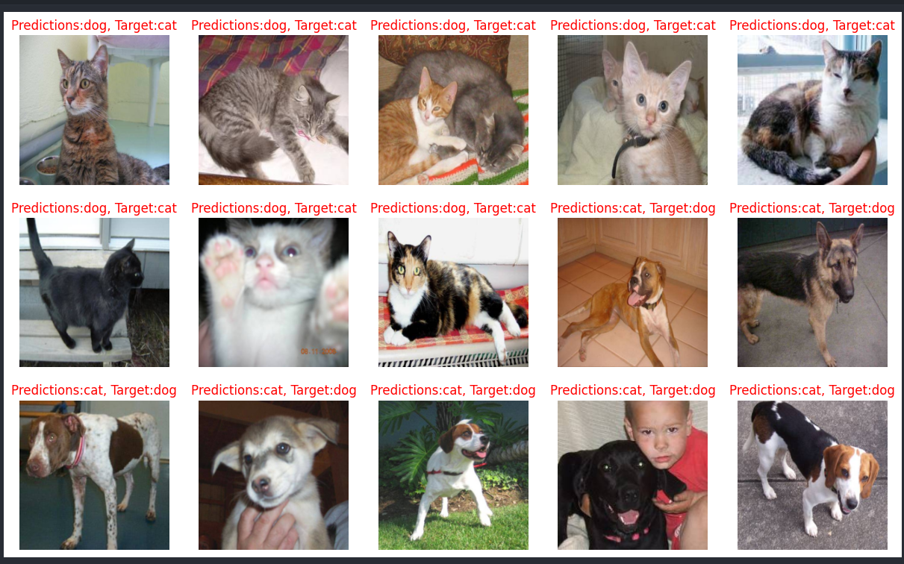

---

## 🛠️ Technologies Used

<strong>Click to View</strong>

- Python 3.x, OpenCV, NumPy, Pandas, Matplotlib  
- PyTorch  
- Flowise (AI Agents)  
- Ollama (embeddings / LLM runtime)  
- Docker  
- Node.js  
- Other image processing libraries  

---

## 🧠 Models Used

- CNNs  
- Segmentation: U-Net, ResNet50  
- Object Detection: YOLO, Detectron2  

---

## 🚀 How to Get Started

1. Click any project link above to explore its repository  
2. Follow the repo instructions to run or contribute  

---

## 📫 Contact

- **Email:** [lalitavai@hotmail.com](mailto:lalitavai@hotmail.com)  
- **GitHub:** https://github.com/lalitavai  

⭐ Thanks for visiting!
